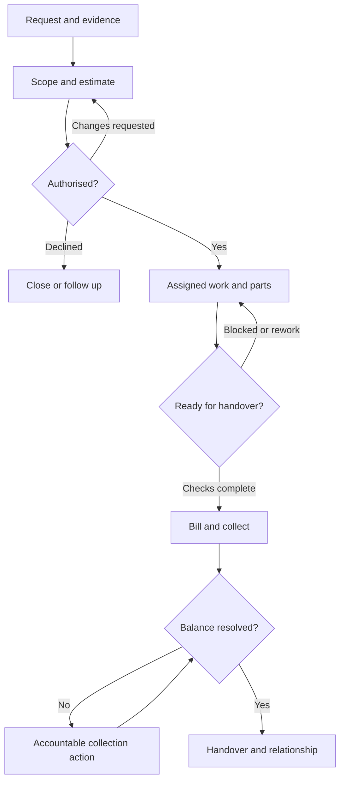

# Full client workflow and problem diagnosis

Analysis date: 5 October 2026, India time. Current application: 2.2.0-rc.1. This is an end-to-end operating specification and discovery framework for our proposed India/Nepal clients. It is **not a report of interviews already performed**. Public evidence is in the [country dossiers](../README.md) and [source register](../SOURCES.md); the scenarios below are our reasoned hypotheses to test against actual work.

The client buys confidence that work will be completed, money collected and responsibilities understood. The product should remove repeated explanation and make exceptions visible. A longer feature menu cannot achieve that unless the underlying records, hand-offs and correction rules are clear.

## 1. Whose problems are we solving?

The owner is the customer, but adoption depends on staff, customers, suppliers and external specialists. A workflow that saves the owner's time by adding unnecessary typing to every technician will probably fail. A fast counter that produces unreconciled balances will fail the accountant.

| Person | Decision they need to make | Proposed pain to investigate | What the workspace must provide |
|---|---|---|---|
| Owner | What needs my decision today? | Must call every staff member to reconstruct work/cash | Exception queue, accountable person, evidence, next action and age |
| Manager | Can we fulfil today's promises? | Job/bay/staff/parts information scattered | Active work, deadline, blocker, assignment and quality readiness |
| Adviser/coordinator | What did we promise this client? | Scope, contact, approval and dates buried in chat | One request history with the exact approved version and next contact |
| Technician | What should I do next and what am I allowed to change? | Unclear priority, missing part, interruption, disputed completed work | Assigned card, complaint, findings, checklist, parts status and limited actions |
| Stock clerk | What quantity exists and why? | Double receiving, hidden consumption, incompatible parts | Item identity, receipt/issue/count source, reason and available quantity |
| Cashier | What is actually payable and received? | Advances/part-payment/returns mixed; payment screenshot mistaken for success | Retained bill, allocations, remaining balance and reviewed receipt method |
| Salesperson | Who should I follow up and what is available? | Lost leads, stale finance status, competing VIN promises | Prospect owner/next date, reservation state, collection and delivery checklist |
| Payroll reviewer | What is owed to staff for this period? | Presence/job time/commission confused; advances counted twice | Reviewed inputs, earning base, approval and payment evidence |
| Accountant | Can I reconcile and file the actual obligations? | Operational summaries presented as complete books | Source exports, document/balance reconciliation and explicit unsupported treatments |
| End customer | What is happening, what did I approve, and what must I pay? | Repeated calls, surprise extras, uncertain completion | Clear scope/version, promised date, evidence and accurate outstanding amount |
| Supplier/subcontractor | What was ordered/received/owed? | Oral orders and quantity/bill differences | Reference-linked order/receipt/bill/payment and discrepancy follow-up |
| Insurer/lender/fleet payer | What is authorised and supported by evidence? | Missing source documents or status mixed with cash | Original evidence, approval/status, expected share and actual collection |

For every client ask who performs each role. One person may perform several roles, but actions should still have identities and permissions. Do not make “small business” mean one shared owner password.

## 2. Follow the business event, not the menu

Every stage should answer eight questions: **what triggered it, what information is required, who owns it, what action changes state, what approval is required, what changes money/stock, what evidence is retained, and what happens if it fails?**

Keep separate states for work, authorisation, finance, stock, quality and follow-up. “Completed” cannot simultaneously mean repaired, approved, invoiced, collected and reconciled. A car can be repaired but unpaid; a received advance can exist before the final bill; a supplier bill can arrive before all parts; an urgent inspection finding can be unapproved work.

This illustrates the garage/service operating contract, not every enforced app transition. In the app, final-stage checks/payment depend on configured rules and owner overrides; cash may be collected earlier as an advance. Insurance businesses may authorise handover with an agreed debtor balance, so configure that policy deliberately rather than force an inappropriate all-payers-paid rule.

## 3. Before opening: setup and switching

**Problem hypothesis:** a new owner enters their business name, then meets a blank dashboard and cannot get useful work done. Or they import old quantities/balances and trust them without checking.

The operator must establish organisation/legal businesses, country/currency/registration, staff roles, sector/speciality, branding, catalogue, stages/checklists, customer terms, approval rules and supported exception policy. Use the six-step configuration, but treat the recorded narrative answers as context requiring explicit settings. There is no automatic programming of arbitrary owner instructions.

Select one reconciliation/cutover date. Preserve original ledgers/exports and decide which historical records remain read-only in the old system. Import supported masters with preview/mapping, review duplicates, count stock and reconcile customer openings. Earlier successful CSV batches remain saved if a later batch fails; use documented duplicate skips on retry, not a blind whole-file repeat with new identities.

Do not import an opening by inventing a new historical tax invoice. Do not assume two customers with one phone number are identical. Agree who can correct an opening, the source reference and reason. Current opening corrections are retained, owner-reviewed records; arbitrary old voucher migration/accounting merge is absent.

First value should be a real-shaped customer, useful catalogue/job and one completed supported transaction. A possible pilot target is first useful transaction within 30 minutes of the reviewed starter setup; measure this rather than promise it. Complex migration/tax review is separate from that target.

## 4. Opening the working day

The owner sees unresolved Sync actions first, then today's/late promises, work awaiting approval/parts/quality, money due, low stock, staff availability and supplier obligations. Each item needs an underlying record, responsible person and a next action. Colour alone must not communicate urgency; use labels and dates.

The manager reviews actual available staff and blocked work. Attendance means presence, not guaranteed free capacity. Job bay labels/time entries are not a resource-optimising scheduler. The current app gives operational visibility; allocation by skill, bay overlap, realistic capacity and route is proposed work.

The cashier verifies opening float and the agreed collecting account; the stock clerk checks incoming goods/shortages; advisers review promised calls. Proposed shift policy should distinguish the person doing a cash count from the person approving a discrepancy. The current cash-count record is a scoped calculation, not a complete multi-till shift/register product.

## 5. First enquiry, repeat client and triage

**Trigger:** walk-in, phone/chat enquiry, booking, fleet request or repeat-service complaint.

Find the client/vehicle/asset before creating another record. Record the request, contact, source, responsibility and first next action. Reuse reviewed contact/terms, but confirm the present request; last year's address or preferred payer may have changed. A saved client language is a communication preference, not consent to every promotional channel.

For a showroom, record model/budget/finance/trade-in interest and next date. For a service team, record site access and asset. For a collision shop, establish who authorises the vehicle's work and whether an insurer/fleet is involved. For a retail walk-in, do not force a full customer dossier when a permitted simple sale is sufficient.

Triage should identify urgency and safety/feasibility, not automatically upsell. A technician's urgent finding must reach the adviser/authorised client. The app does not autonomously assess roadworthiness, warranty entitlement or clinical/regulated risk.

**Failure cases:** unknown contact, duplicate client, no availability, unserviceable vehicle, out-of-area visit, declined enquiry and customer who only wants a price. Retain the outcome/next date where justified; do not leave every declined request as active work.

## 6. Intake, inspection and custody

Capture complaint, asset/vehicle identification, arrival condition, odometer/serial if relevant, authorised contact, promised date and originals/photos appropriate to the job. Avoid collecting unrelated personal data. Record keys/accessories/custody only if the business actually uses a reviewed field/checklist; the current app has no complete custody/legal acceptance form.

Inspection findings have area, condition, notes and recommendation. Keep unchecked areas visible; “good” should mean checked, not a form default. Assigned technicians can record permitted findings. Adviser/customer authorisation is separate. Cloud upload limits require selecting relevant photos rather than silently accepting a large archive.

**Typical problem to verify:** customer disputes pre-existing damage or says the extra work was never approved. The product response is traceable evidence/time/person/scope, not an editable final paragraph that overwrites the earlier version.

Measure whether staff can complete a useful intake on the actual phone in a busy environment. Mandatory fields must justify the decision they support. A 25-field form will be ignored if most fields have no immediate purpose.

## 7. Estimate and commercial agreement

Use reviewed catalogue/service lines, quantities, parts alternatives, labour, subcontract work, discounts, tax treatment, validity, exclusions and expected completion. Explain price to the customer in their agreed channel. Customer/quantity pricing can prefill the fast bill path; it does not universally automate every quote/contract price.

Separate diagnosis, recommended work, mandatory/authorised work and optional future work. If the customer authorises only some recommendations, record the approved scope explicitly. If the supported app approval model cannot represent a complex partial scope, issue a revised appropriate quote; do not imply line-level authorisation that is not stored.

Retain a quote version and seller/client details. Changing the business's logo/legal name later must not rewrite issued document history. A draft may be revised; issuance/posted amounts require the supported retained correction paths.

**Failure cases:** wrong tax setup, ambiguous parts quality, client-supplied part, rate dispute, unrealistic delivery, expiry, supplier cost change and price entered in the wrong currency. Country is a business boundary; do not relabel existing financial records to “convert” INR/NPR.

## 8. Approval and deposit

Record who approved, what version/scope, when, channel and retained supporting evidence. The current approval record is not delivery of an external e-signature service or verification of the customer's identity. For insurance work, record customer and insurer authority without inventing an independent competitor quotation.

If the owner requires approval before linked work, use the supported work gate. Avoid a culture where staff routinely ask the owner to override because the setup is wrong. An override must have a meaningful reason and audit; it is an exception, not hidden automatic approval.

Record actual advances separately from an issued bill. Allocating an advance later is not receiving new money again. Keep payer/reference and refund terms. A lender's finance approval or an insurer's sanction is not a deposit.

**Failure cases:** client unreachable, verbal-only approval, changed scope after approval, approval expires, deposit fails/reverses or client cancels. Keep a dated next action and clear unresolved state; do not start expensive work just because the quote exists.

## 9. Scheduling and assignment

Assign a responsible technician/team and meaningful stage. Identify promised date, tasks/checklist and required parts. Determine who can change the promise and who informs the client. A date field without accountability merely stores a missed promise.

Current jobs/stages, assignments, tasks, bays/time entries and appointments support basic coordination. Future scheduling should account for skill, hours, bay/equipment capacity, estimated duration, dependencies and urgent work, with conflicts explained to the manager. That algorithm is not implemented by the current labels.

**Failure cases:** staff absent, job misassigned, part delayed, paint booth occupied, subcontractor unavailable and overbooking. Record blocker, owner and next check date; propose a new realistic promise and retain the reason. Automatic customer notification is currently absent.

## 10. Procurement, receipt and supplier obligation

Use the part/item identity and required quantity, supplier, order reference, expected arrival and source job. Decide whether to order stock or a one-off subcontract/service. Approving an order, receiving goods, recording the supplier bill and paying it are different events.

The stock clerk records what actually arrived; partial receipts remain partial. The reviewer checks invoice/reference/quantity/price/tax and discrepancy. Supplier bill entry must not receive the item twice. Payment reduces the supported supplier obligation; it does not prove goods arrived or settle an unrecorded return.

**Failure cases:** substitute part, incompatible model, damaged goods, invoice duplicates, bill arrives before goods, quantity mismatch, supplier credit and returned purchase. Current partial receipts/bills/payments exist; a complete supplier-return/credit ledger, landed-cost/import allocation, batch expiry, advanced unit conversion and multi-warehouse movement remain separate work.

Avoid “fixing” every discrepancy with an unexplained stock adjustment. Use a reasoned physical count/correction within supported scope and a reviewed supplier process for unsupported accounting. Track what needs supplier follow-up rather than making the ledger look artificially clean.

## 11. Work execution and additional findings

Technicians should see the authorised task, necessary evidence, requested/available parts and completion checks. They record findings, notes, time and blockers; they should not have to switch among unrelated finance screens. Work time, attendance and billable labour are separate concepts.

Consume a part against the job using supported stock movements; later billing must not deduct it again. Do not bill a recommendation simply because a timer ran. If a part was supplied by the client, agree warranty/cost/treatment rather than consume business inventory incorrectly.

Additional damage after dismantling creates a new scope/quote decision and new authorisation where required. Preserve prior approval. Stopping work for a supplement should identify who contacts whom and when. Rework under a promised repair warranty needs a reviewed no-charge/charge decision; advanced warranty adjudication/cost recovery is absent.

**Failure cases:** forgotten time stop, two people edit a task, damaged consumed part, wrong part issued, staff change or connection loss. A conflict must surface instead of silently overwriting; monetary/stock commands need server confirmation and their original operation IDs.

## 12. Quality check and completion

Completion means the actual supported checklist and inspections are reviewed, not just moving a card to a green column. Use sector-specific tests appropriate to the work: fit/function, repair explanation, document checks or service test. Do not use software checkboxes as independent safety certification.

The final configured job stage drives completion alerts. If handover checks are required, the app enforces the configured checklist, with reasoned owner overrides. This is only as useful as the chosen checklist and staff's actual practice. An irrelevant generic checklist creates habitual false ticks.

**Failure cases:** unfinished subtask, new defect, parts still on order, client requests another change, failed test and missing delivery document. Reopen/hold the operational work within supported transitions; do not issue unnecessary financial reversals when the bill remains correct. Rework and financial correction are different decisions.

## 13. Billing and retained corrections

The reviewer checks authorised billable scope, consumed parts, customer/payer, prices/discounts, relevant taxes, advances and business/legal identity. Invoice issue is deliberate and retained. A draft/cart is not an issued statutory document or a stock reservation by itself.

India requires applicability review of the supported domestic GST path and unsupported IRP/special cases. Nepal requires electronic-billing approval/procedure/CBMS review; this app has no claimed IRD approval/integration. Use the [country guides](../README.md) before live statutory billing. A polished PDF does not remove these dependencies.

After issue use the supported credit/refund paths, with references to original lines/amounts. A full return must reverse the original rounded amounts; partial returns must not exceed original quantities. Returning money and returning sellable stock are separate actions. Do not silently edit/delete a posted bill to resolve a customer's complaint.

**Failure cases:** bill issued to wrong client, mixed/split payers, cancellation, part-only return, uncertain issue response and unsupported progressive/milestone billing. Treat unsupported cases as discovery gaps requiring a maintained workflow, not a recommendation to improvise ledger edits.

## 14. Collection, outstanding balance and disputes

Find the retained bill/opening, actual debtor/payer and existing allocations before entering a receipt. Record amount, method, reference and date once. Apply an advance once. The balance includes applicable retained openings/bills/credits/receipts/refunds; incomplete financial permissions should not present an apparently complete statement.

Manual provider references/screenshots are evidence, not verified settlement. Automated payment reconciliation is proposed. Cash-count arithmetic covers configured opening float and supported cash movements; unrecorded drawings or payroll-paid markers are not magically included. Keep the full accountant process separate.

If a response is lost, look in Sync and retry the same operation ID. Do not manually add another payment because a spinner stopped. If a dispute exists, record the item, responsible contact and next date; an overdue balance without an action does not improve collections.

**Worked operational example:** agreed work is 10,000; actual receipt is 3,000; balance is 7,000. Direct entered cost of 6,000 gives a 4,000 contribution estimate, while current gross collection is only 3,000. Neither number is net profit or bank balance. Taxes, overhead, depreciation, unpaid supplier costs and other accounting treatments require their own reviewed records. An owner must not confuse sales, cash and contribution.

## 15. Handover, delivery and completion of the promise

Confirm authorised recipient, checks/documents, collection/credit policy, explanation of work and next service/relationship action. A showroom uses chassis/PDI/document checks; a service team confirms the completed asset/site scope; a retailer confirms collection/packing where appropriate.

If the business allows handover with fleet/insurer credit, configure the policy and accountable collection action. If all-payment handover is required, the app's supported gate must block ordinary staff, with recorded owner exceptions. A signed external handover/custody flow is not automatically implemented by a checklist note.

**Failure cases:** client unavailable, delivery delay, wrong recipient, incomplete documents, defect discovered at collection and unpaid agreed amount. Keep the responsibility/promise alive; do not hide the case by marking every workflow “done”.

## 16. After-sales, follow-ups and recurring relationships

Set a reasoned next action, due date and owner: collect remaining debt, confirm repair satisfaction, recheck a fault, renew a contract, contact a paused lead or invite an agreed service. The customer may decline/choose a channel. Transactional updates and marketing need different policies.

Current follow-ups/agreements/client preferences are records and rule-generated views. No automatic WhatsApp/SMS/email campaigns, customer portal or recurring charge engine is implemented. Staff must actually perform/log the contact; a due badge is not a delivered message.

Measure attempted/completed/outcome/next-date follow-ups separately. A high count of reminders can reflect unresolved work rather than better customer care. Renewal promises, prepaid entitlements and warranty rights must not be invented from a single generic “agreement” record.

## 17. Attendance, payroll and commissions

At shift end reconcile actual attendance and missing/overnight entries with the worker/supervisor. Separately review task time and blocked/rework reasons. Avoid using timers as automatic wage/billing evidence without the business's policy and appropriate review.

Before payroll identify period, pay basis, approved attendance, advances, deductions/contributions and earned commission. Current calculation/approval/payment reservation prevents specific duplicates; it does not file statutory payroll or transfer wages. Indian state/central obligations and Nepal Labour/SSF requirements need a qualified actual-client review.

Commission needs an explicit base, exclusions, collection condition, split/target/return policy and approver. Current fixed earned/collection-linked entries are narrower than a configurable tier/split/clawback engine. Test part-payment, returned sale and commission already included in another run. Staff should understand the amount without gaining access to everyone else's salary.

## 18. Day-end, month-end and management

Day-end: resolve uncertain commands, compare scoped cash count and source movements, check uncollected bills/advances, unexplained stock changes and unfinished promises. A variance needs a reason/investigation, not a casual delete. Later cash entries can make an earlier closure need review; the app flags that.

Month-end: reconcile operational balances/stock/supplier obligations to the accepted accountant system, review payroll/commission, evidence/document gaps, credit ageing, rework, next renewals and backup recovery. The app has no complete double-entry ledger, bank reconciliation, statutory closing journal or full audited P&L.

Owner analytics should answer an action: which delayed jobs have most money tied up, which clients need contact, what margin inputs changed, what parts repeatedly block work, which promises are consistently unrealistic, and which records need correction. Many advanced cross-record analytics are proposals; do not make a dashboard imply accounting completeness or AI understanding of unavailable data.

## 19. Exceptions and failure recovery are part of the workflow

| Failure | Correct operating response | Current boundary / acceptance |
|---|---|---|
| Lost connection before draft save | Clearly show encrypted device draft/pending state | Offline enabled/unlocked on a trusted device, 24-hour expiry |
| Lost response after money/stock submission | Inspect/retry same command ID, verify retained result | Never submit a new manual duplicate; app idempotency tested |
| Two staff edit one record | Review conflict/latest version | Optimistic version conflicts; no silent merge |
| Wrong master import in one batch | Review preview/source and retained result; controlled correction | Each 250-row batch atomic, earlier batches remain; no fuzzy undo-everything |
| Phone lost/staff leaves | Disable account, review access, remove cache where available | Already offline cache expires; instant remote wipe/MFA absent |
| Owner forgot password | Use tested edition-specific administrator recovery process | SQLite console path exists; cloud self-service recovery incomplete |
| Server/storage outage | Named operator, protected backup and isolated tested restore | Cloud JSON export is not provider backup; no availability guarantee |
| Restore rolls back acknowledged transactions | Reconcile external evidence and old commands before replay | Old outcomes may be missing after recovery point; no blind resend |
| Client return/refund | Credit original supported line; decide sellable stock; record actual cash refund | Supplier/vehicle return and advanced warranty accounting incomplete |
| Business changes tax/legal identity | Reviewed new settings/series/business as appropriate; retain snapshots | Never reinterpret historical currency/issued seller snapshots |
| Unauthorised scope/discount | Stop/escalate to permitted reviewer, retain evidence/reason | Owner gates are narrow explicit rules, not unlimited manager authority |
| Account/data exposure suspicion | Disable affected access, preserve restricted evidence, qualified assessment | Independent review/production response still required |

## 20. How to discover the client's actual problems

Observe three recent real-shaped cases: an ordinary completed job/sale, one blocked/disputed case, and one collection/return exception. With consent, use anonymised documents and shadow each role. Ask the staff to show what they did, what they had to retype, whom they asked, what information was missing and how they verified the amount/quantity.

For each observed failure record: event, person, missing information, workaround, frequency in an agreed sample, minutes/rework/financial exposure, existing software, desired outcome and proposed fix. Mark assumptions as assumptions. Do not invent loss percentages or make staff admit a “pain point” because the questionnaire suggests it.

Use the [discovery worksheet](../discovery/CLIENT_WORKSHEET.md). Prioritise any money/stock correctness, access or restore defect first; then frequent high-effort tasks; then integrations and preferences. Validate with staff performing the task unaided, on their actual phone and PC. The product should adapt to evidenced workflows, not make every client accept the developer's favourite dashboard.

## 21. Evidence of success and what to build next

Proposed measures: median/p95 task time, help requests, duplicate/conflicting records, unresolved Sync age, promised-date slippage, approval waits, overdue actions, ageing collections, stock discrepancies, rework, onboarding/import effort, support minutes, operating cost and measured recovery. Define denominators/time windows and compare similar business volume; a short pilot is not causal proof.

The next work should follow actual pilot blockers: country billing approval/integration, Nepali/regional language/date fit, provider payment matching, safer supplier corrections/returns, resource scheduling, account recovery/MFA, larger-history server pagination and agreed accountant exports. Customer messaging/portal and advanced commission/loyalty/commerce can follow validated demand and consent/provider design.

The current app already supports much of the operational core. It cannot yet replace every client's accounting, statutory payroll, dealer system, payment provider or specialised vertical suite. [Feature priorities](../FEATURE_PRIORITIES.md) and [release gates](../../docs/RELEASE_GATES.md) keep that promise precise.
